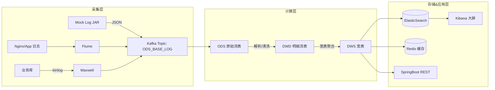

# Spark Realtime 项目（Mac M4 环境）

> 基于尚硅谷 Spark Streaming 实时项目课程，在 **Apple Silicon / macOS** 本地一机版环境搭建：Mock 日志 → Kafka → Spark Streaming 分流 → DWD 多主题输出。本文记录环境、脚本、运行、常见坑以及后续扩展计划（Maxwell、ES、Redis、大屏）。

---

## 目录

* [项目简介](#项目简介)
* [项目架构](#项目架构)
* [仓库结构](#仓库结构)
* [环境要求](#环境要求)
* [快速开始 TL;DR](#快速开始-tldr)
* [详细安装与配置](#详细安装与配置)

  * [1. JDK 多版本管理 (8 + 17)](#1-jdk-多版本管理-8--17)
  * [2. Kafka (Homebrew) 安装与配置](#2-kafka-homebrew-安装与配置)
  * [3. Mock Log 日志生成器部署](#3-mock-log-日志生成器部署)
  * [4. Kafka 辅助脚本 kfsh](#4-kafka-辅助脚本-kfsh)
  * [5. Mock 日志脚本 logsh](#5-mock-日志脚本-logsh)
  * [6. 创建 Kafka Topics](#6-创建-kafka-topics)
* [工程构建 (Maven)](#工程构建-maven)
* [运行实时分流程序 OdsBaseLogApp](#运行实时分流程序-odsbaselogapp)
* [Kafka 主题说明 (ODS / DWD)](#kafka-主题说明-ods--dwd)
* [数据样例](#数据样例)
* [常见问题排查](#常见问题排查)
* [开发工作流 (Git / IDEA)](#开发工作流-git--idea)
* [后续路线 / TODO](#后续路线--todo)
* [鸣谢 & 版权声明](#鸣谢--版权声明)

---

## 项目简介

课程来源：尚硅谷《大数据项目之 Spark 实时》。本仓库实现其中**日志采集 → Kafka → Spark Streaming 分流到 DWD 多主题**部分，并在 Mac M4 (Apple Silicon) 环境下做了适配：

* Kafka 通过 Homebrew 安装，路径自动探测。
* Kafka 与 Mock Jar 对应不同 JDK（Kafka 要 JDK17+；Mock Jar 要 JDK8）。
* 编写 `kf.sh`、`log.sh` 辅助脚本，简化启动、验证。
* Spark Streaming 程序使用 Scala 2.12 + Spark 3.0.0（课程版），在 IDEA 本地 Local\[4] 模式运行。
* 使用 Fastjson `SerializeConfig(true)` 修正 Scala case class → JSON `{}` 问题。
* 实现 ODS → DWD：Error / Start / Page / Display(页面曝光) / Action(页面动作) 扁平化输出。

---

## 项目架构



本仓库当前聚焦 **采集层 Mock → Kafka** 与 **计算层 ODS → DWD 分流**。

---

## 仓库结构

```
spark-realtime/
├─ pom.xml                       # 聚合父 POM
├─ .gitignore
├─ README.md                     # 本文件
├─ scripts/                      # 推荐：运行环境脚本（kf.sh, log.sh, ...）
│
├─ sparkStreaming-realtime/      # 主业务模块
│  ├─ pom.xml
│  └─ src/
│     ├─ main/
│     │  ├─ resources/
│     │  │  ├─ config.properties          # kafka.bootstrap.servers 等
│     │  │  └─ log4j.properties           # Spark 本地日志级别
│     │  └─ scala/com/atguigu/gmall/realtime/
│     │     ├─ app/OdsBaseLogApp.scala    # ODS→DWD 分流主程序
│     │     ├─ bean/                      # DWD 宽表样例类
│     │     │   ├─ PageLog.scala
│     │     │   ├─ PageDisplayLog.scala
│     │     │   ├─ PageActionLog.scala
│     │     │   └─ StartLog.scala
│     │     └─ util/                      # 工具类
│     │         ├─ MyConfig.scala         # key 常量
│     │         ├─ MyPropsUtils.scala     # 属性读取
│     │         └─ MyKafkaUtils.scala     # Kafka 生产/消费封装
│     └─ test/... (暂无)
│
└─ src/main/java/org/example/Main.java    # 父模块示例入口（可删）
```

---

## 环境要求

| 组件     | 推荐版本                 | 说明                      |
| ------ | -------------------- | ----------------------- |
| macOS  | Sonoma / 最新          | Apple Silicon M4 Tested |
| JDK8   | 1.8.0\_452 (Temurin) | 运行 Mock 日志 Jar          |
| JDK17+ | Temurin 17 / Zulu 17 | Kafka 3.x 脚本运行建议        |
| Scala  | 2.12.x               | 与 Spark 3.0.0 对齐        |
| Spark  | 3.0.0                | 课程版本；本地 Local 模式        |
| Kafka  | Homebrew 最新（3.x）     | 本地单节点；监听 9092           |

---

## 快速开始 TL;DR

```bash
# 0. 克隆项目
git clone https://github.com/LeyiHuang0123/spark-realtime.git
cd spark-realtime

# 1. 配置 Kafka 地址（如非默认）
vi sparkStreaming-realtime/src/main/resources/config.properties
# kafka.bootstrap.servers=localhost:9092

# 2. 构建
mvn -q clean package -DskipTests

# 3. 启动 Kafka（Homebrew）
./scripts/kf.sh start  
./scripts/kf.sh list

# 4. 创建源 Topic（首次）
./scripts/kf.sh create ODS_BASE_LOG 3

# 5. 启动 Mock 日志 → Kafka
./scripts/log.sh 2025-07-17   # 或不传日期走 application.yml

# 6. 验证源数据
./scripts/kf.sh kc ODS_BASE_LOG

# 7. IDEA 运行 OdsBaseLogApp（Local[4]）
# 8. 验证分流
./scripts/kf.sh kc DWD_PAGE_LOG
./scripts/kf.sh kc DWD_ACTION_LOG
./scripts/kf.sh kc DWD_DISPLAY_LOG
./scripts/kf.sh kc DWD_START_LOG
./scripts/kf.sh kc DWD_ERROR_LOG
```

---

## 详细安装与配置

### 1. JDK 多版本管理 (8 + 17)

Kafka 3.x 命令工具需要较新 JDK（17）；课程 Mock Jar 构建于 JDK8。建议并行安装并切换：

```bash
# 查可用版本
/usr/libexec/java_home -V

# 导出变量
export JAVA8_HOME=$(/usr/libexec/java_home -v 1.8)
export JAVA17_HOME=$(/usr/libexec/java_home -v 17)

# 快捷 alias（追加到 ~/.zshrc）
alias use8='export JAVA_HOME=$JAVA8_HOME; java -version'
alias use17='export JAVA_HOME=$JAVA17_HOME; java -version'
```

在脚本中可显式调用：`"$JAVA8_HOME/bin/java" -jar ...` 避免污染全局。

---

### 2. Kafka (Homebrew) 安装与配置

```bash
brew install kafka  # 会同时安装 zookeeper-kafka（内置）
```

**主配置文件路径（M 芯片 Homebrew 默认）：**

```
/opt/homebrew/opt/kafka
└─ config/server.properties
```

要监听本地 9092：在 `server.properties` 中确认 / 追加：

```
listeners=PLAINTEXT://0.0.0.0:9092
```

Homebrew 服务启动（后台常驻）：

```bash
brew services start kafka
brew services list    # 查看状态
```

也可用脚本（见 [4. Kafka 辅助脚本 kf.sh](#4-kafka-辅助脚本-kfsh)）。

---

### 3. Mock Log 日志生成器部署

课程 Jar：`gmall2020-mock-log-2021-11-29.jar`（不随仓库分发，版权归尚硅谷）。

推荐放置：`/opt/module/applog/`（本地运行目录，可自定）。

目录示例：

```
/opt/module/applog/
  ├─ gmall2020-mock-log-2021-11-29.jar
  ├─ application.yml            # mock 配置（日期/输出方式/Kafka地址）
  ├─ logback.xml                # 日志滚动配置（修改路径防权限报错）
  ├─ log/                       # 运行日志输出（确保可写）
  ├─ log.sh                     # 启动脚本（见下）
  └─ kf.sh                      # Kafka 脚本（可共享）
```

**application.yml 样例：**

```yaml
mock:
  date: "2025-07-17"           # 不填使用当天；脚本可覆盖
  type: "kafka"                # kafka | console | logfile
  kafka-server: "localhost:9092"
  kafka-topic: "ODS_BASE_LOG"
```

> 首次运行若报 `Failed to create parent directories for /opt/module/applog/log/app.log`，请先创建 `log/` 并赋权：`sudo mkdir -p /opt/module/applog/log && sudo chown -R $(whoami)`。

---

### 4. Kafka 辅助脚本 kf.sh

用于本地单机 Kafka 快捷启停 / 列表 / 消费 / 生产 / 描述。

参考：`./scripts/kf.sh`

> 可将脚本加入 PATH：`chmod +x scripts/kf.sh && ln -s $PWD/scripts/kf.sh /usr/local/bin/kf.sh`。

---

### 5. Mock 日志脚本 log.sh

按日期生成日志并输出 Kafka；没有传参则使用 `application.yml` 中日期。

参考：`./scripts/log.sh`

---

### 6. 创建 Kafka Topics

* 源：`ODS_BASE_LOG`
* 目标（DWD）：

  * `DWD_ERROR_LOG`
  * `DWD_START_LOG`
  * `DWD_PAGE_LOG`
  * `DWD_DISPLAY_LOG`
  * `DWD_ACTION_LOG`


---

## 工程构建 (Maven)

根 `pom.xml`（父）聚合子模块；主要业务在 `sparkStreaming-realtime` 子模块。确保 JDK 编译级别 1.8（与 Scala/Spark 兼容），不要使用 23。

**父 POM 要点（片段）：**

```xml
<properties>
  <java.version>1.8</java.version>
  <maven.compiler.source>${java.version}</maven.compiler.source>
  <maven.compiler.target>${java.version}</maven.compiler.target>
  <project.build.sourceEncoding>UTF-8</project.build.sourceEncoding>
</properties>
```

**子模块（sparkStreaming-realtime）版本变量：**

```xml
<properties>
  <spark.version>3.0.0</spark.version>
  <scala.version>2.12.11</scala.version>
  <kafka.version>2.4.1</kafka.version>
  <java.version>1.8</java.version>
</properties>
```

依赖（节选）：Spark Core / Streaming / SQL，Kafka client，spark-streaming-kafka-0-10，fastjson，mysql-connector-java，jedis，elasticsearch-rest-high-level-client 等。详见子模块 `pom.xml`。

**构建命令：**

```bash
mvn -q clean package -DskipTests
# 或仅构建子模块
mvn -q -pl sparkStreaming-realtime -am clean package -DskipTests
```

构建产物位于：`sparkStreaming-realtime/target/`。

---

## 运行实时分流程序 OdsBaseLogApp

### 0. 配置 Kafka 地址

编辑 `sparkStreaming-realtime/src/main/resources/config.properties`：

```
kafka.bootstrap.servers=localhost:9092
spark.batch.interval=5
```

### 1. IDEA 运行配置

* Run/Debug Configurations → + → *Application*。
* Name: `OdsBaseLogApp`。
* Main class: `com.atguigu.gmall.realtime.app.OdsBaseLogApp`。
* Use classpath of module: **sparkStreaming-realtime**。
* JRE：建议 **JDK8**（程序兼容 8；若你已升级也可用 17）。

### 2. 运行

点击 Run，日志应显示 StreamingContext 启动，随后持续处理 Kafka 数据。

### 3. 验证分流

在另一个终端：

```bash
./scripts/kf.sh kc DWD_PAGE_LOG
./scripts/kf.sh kc DWD_ACTION_LOG
./scripts/kf.sh kc DWD_DISPLAY_LOG
./scripts/kf.sh kc DWD_START_LOG
./scripts/kf.sh kc DWD_ERROR_LOG
```

若看到 `{}` 而非字段，请参见 [常见问题排查](#常见问题排查) 中 Fastjson 说明。

---

## Kafka 主题说明 (ODS / DWD)

| Topic             | 粒度        | 来源                            | 说明                                    |
| ----------------- | --------- | ----------------------------- | ------------------------------------- |
| ODS\_BASE\_LOG    | 原始埋点 JSON | Mock Jar / Flume / Maxwell    | 未清洗原始日志；含 common/err/page/start 等混合结构 |
| DWD\_ERROR\_LOG   | 错误        | 解析 obj.err                    | 错误信息；JSON 或扁平化结构                      |
| DWD\_START\_LOG   | 启动        | obj.start                     | 应用启动入口、广告曝光、耗时                        |
| DWD\_PAGE\_LOG    | 页面主记录     | obj.page + common             | 页面访问宽表                                |
| DWD\_DISPLAY\_LOG | 页面曝光      | obj.displays\[] + common+page | 曝光位、物料、序号                             |
| DWD\_ACTION\_LOG  | 页面动作      | obj.actions\[] + common+page  | 行为事件：收藏、加购、分享等                        |

---

## 数据样例

### ODS 原始（含错误，无 page/start）

```json
{"common":{"ar":"4","uid":"61","os":"Android 11.0","ch":"xiaomi","is_new":"1","md":"Xiaomi 9","mid":"mid_114","vc":"v2.1.134","ba":"Xiaomi"},"err":{"msg":" Exception in thread \\  java.net.SocketTimeoutException...","error_code":2768},"ts":1750647613000}
```

### DWD\_PAGE\_LOG（扁平化后）

```json
{"mid":"mid_177","user_id":"27","province_id":"1","channel":"Appstore","is_new":"1","model":"iPhone Xs","operate_system":"iOS 13.2.3","version_code":"v2.1.132","brand":"iPhone","page_id":"good_list","last_page_id":"home","page_item":"keyword","page_item_type":"keyword","during_time":4090,"sourceType":"","ts":1750560956000}
```

### DWD\_DISPLAY\_LOG（页面曝光宽表）

```json
{"mid":"mid_177","user_id":"27","province_id":"1","channel":"Appstore","is_new":"1","model":"iPhone Xs","operate_system":"iOS 13.2.3","version_code":"v2.1.132","brand":"iPhone","page_id":"good_list","last_page_id":"home","page_item":"keyword","page_item_type":"keyword","during_time":4090,"sourceType":"","display_type":"promotion","display_item":"22","display_item_type":"sku_id","display_order":"6","display_pos_id":"1","ts":1750560956000}
```

---

## 常见问题排查

### 1. Kafka CLI 报 UnsupportedClassVersionError (class file version 61.0)

**现象：**

```
java.lang.UnsupportedClassVersionError: ... compiled by a more recent version ... up to 52.0
```

**原因：** Kafka 脚本运行在 JDK17+ 编译，当前 `java` 是 JDK8。
**解决：** 切到 JDK17：

```bash
export JAVA_HOME=$(/usr/libexec/java_home -v 17)
java -version
```

或者在 `kf.sh` 内部显式调用 `$JAVA17_HOME`。

---

### 2. Mock Jar 启动报 logback 无法创建文件

**现象：**

```
Failed to create parent directories for /opt/module/applog/log/app.log
```

**解决：**

```bash
sudo mkdir -p /opt/module/applog/log
sudo chown -R $(whoami) /opt/module/applog
```

---

### 3. PageLog / DisplayLog 序列化成 `{}`

**原因：** Fastjson 默认通过 getter 反射 JavaBean；Scala case class 无标准 getter → 输出空对象。
**修复：** `SerializeConfig(true)` 启用 fieldBased。

```scala
import com.alibaba.fastjson.serializer.{SerializeConfig, SerializerFeature}
private val fastjsonCfg      = new SerializeConfig(true)
private val fastjsonFeatures = Array(SerializerFeature.DisableCircularReferenceDetect)
MyKafkaUtils.send(DWD_PAGE_LOG, JSON.toJSONString(pageLog, fastjsonCfg, fastjsonFeatures:_*))
```

或改用手工构 `JSONObject`。

---

### 4. sourceType 字段总是空

Mock 数据中多数 page 记录没有 `source_type`；可兼容 `sourceType`；还可退化用 `last_page_id`。

```scala
val sourceType = {
  val u1 = gs(pageObj, "source_type")
  if (u1.nonEmpty) u1 else gs(pageObj, "sourceType")
}
```

---

### 5. IDEA Commit 报 “--author is not 'Name <email>'”

在项目根配置 Git 作者：

```bash
git config user.name  "你的名字"
git config user.email "you@example.com"
```

并在 Commit 面板选择 *Use Git default*。

---

## 开发工作流 (Git / IDEA)

### 首次

```bash
git clone <repo>
cd spark-realtime
mvn -q clean package -DskipTests
```

### 开发分支

```bash
git checkout -b feature/dwd-flatten
# 修改...
git add -u
git commit -m "feat: something"
git push -u origin feature/dwd-flatten
```

### 更新主分支

```bash
git checkout main
git pull --rebase
```

---

## 后续路线 / TODO

* [ ] 接入 Maxwell 读取 MySQL binlog → Kafka → 维度补齐
* [ ] DWD → DWS 聚合（UV、SV、页面停留、渠道分析）
* [ ] Sink Redis 缓存热点指标
* [ ] Sink ElasticSearch + Kibana 实时大屏
* [ ] Structured Streaming 重写（考虑 Watermark）
* [ ] 容错 / Checkpoint / Offset 管理完善（Redis / Kafka Commit）
* [ ] Docker Compose 一键起全栈

---

## 版权声明

* 课程素材、Mock 数据 Jar、业务字段定义来源：**尚硅谷** 官方教学资料。
* 本仓库为个人学习记录，包含针对 Mac M4 环境的调试脚本与补丁。

---
